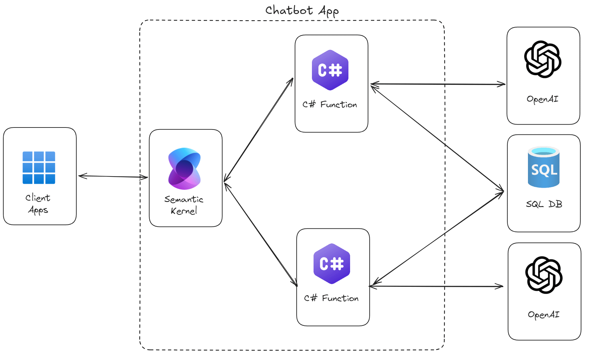
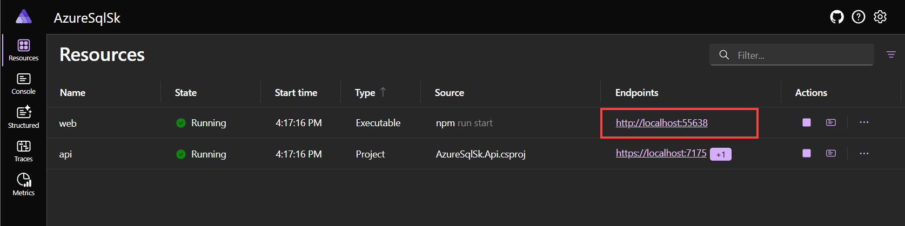

# Azure SQL Chat with your data - Insurance Sample

This is a simple example of a chatbot that uses Azure SQL to store and retrieve data using both RAG and Natural-Language-to-SQL (NL2QL) to allow chat on both structured and non-structured data. The bot is built using the Microsoft Semantic Kernel Framework and the newly added support for vectors in Azure SQL.


## Architecture



## Solution

The solution is composed of three main Azure components:

- [Azure SQL Database](https://learn.microsoft.com/azure/azure-sql/database/sql-database-paas-overview?view=azuresql): The database that stores the data.
- [Azure Open AI](https://learn.microsoft.com/azure/ai-services/openai/): The language model that generates the text and the embeddings.
- [Semantic Kernel](https://learn.microsoft.com/semantic-kernel/overview/): The library used to orchestrate calls to LLM to do RAG and NL2SQL and to store long-term memories in the database.

### Project Structure

- `AzureSqlSk.Api` - ASP.NET Core Web API project containing the chat and Semantic Kernel logic
- `AzureSqlSk.Web` - Vue.js frontend project with a modern chat interface
- `AzureSqlSk.Shared` - Shared library containing common models and interfaces
- `AzureSqlSk.AppHost` - .NET Aspire host project that orchestrates the API and frontend
- `AzureSqlSk.Console` - Console application for database deployment and chat interaction

### Azure Open AI

Make sure to have two models deployed, one for generating embeddings (*text-embedding-ada-002* model recommended) and one for handling the chat (*gpt-4o* recommended). You can use the Azure OpenAI service to deploy the models. Make sure to have the endpoint and the API key ready. The two models are assumed to be deployed with the following names:

- Embedding model: `text-embedding-ada-002`
- Chat model: `gpt-4o`

## Prerequisites

- .NET 8.0 SDK
- Node.js 18.x or later
- Azure OpenAI API key
- Azure SQL Database connection string

## Configuration

### Console Application

The console application is primarily used to deploy the database objects and sample data. It also contains a chat interface for testing the bot as an alternative to the web interface.

> [!NOTE]
> If you are only planning on using the web interface, you can skip the `OPENAI` settings in the `.env` file.

Copy `.env.sample` to `.env` in the `AzureSqlSk.Console` directory and update the following values:

- `OPENAI_URL`: specify the URL of your Azure OpenAI endpoint, eg: 'https://my-open-ai.openai.azure.com/'
- `OPENAI_KEY`: specify the API key of your Azure OpenAI endpoint
- `OPENAI_EMBEDDING_DEPLOYMENT_NAME`: specify the deployment name of your Azure OpenAI embedding endpoint, eg: 'text-embedding-ada-002'
- `OPENAI_CHAT_DEPLOYMENT_NAME`: specify the deployment name of your Azure OpenAI chat endpoint, eg: 'gpt-4o'

- `MSSQL_CONNECTION_STRING`: the connection string to the Azure SQL database where you want to deploy the database objects and sample data
- `MSSQL_TABLE_NAME`: the name of the table where the chatbot will store long-term memories (default value is 'ChatMemories')

### API Application

The API application is an ASP.NET Core Web API that exposes the chatbot functionality. It uses the Semantic Kernel to orchestrate calls to the Azure OpenAI service and the Azure SQL database.

Copy `appsettings.Development.Sample.json` to `appsettings.Development.json` in the `AzureSqlSk.Api` directory and update the following values:

- `AzureOpenAI:Endpoint`: specify the URL of your Azure OpenAI endpoint, eg: 'https://my-open-ai.openai.azure.com/'
- `AzureOpenAI:ApiKey`: specify the API key of your Azure OpenAI endpoint
- `AzureOpenAI:EmbeddingDeploymentName`: specify the deployment name of your Azure OpenAI embedding endpoint, eg: 'text-embedding-ada-002'
- `AzureOpenAI:ChatDeploymentName`: specify the deployment name of your Azure OpenAI chat endpoint, eg: 'gpt-4o'
- `SqlServer:ConnectionString`: the connection string to the Azure SQL database where you want to store the long-term memories
- `SqlServer:TableName`: the name of the table where the chatbot will store long-term memories (default value is 'ChatMemories')

Example of `appsettings.Development.json`:

```json
{
  "Logging": {
    "LogLevel": {
      "Default": "Information",
      "Microsoft.AspNetCore": "Warning"
    }
  },
  "AllowedHosts": "*",
  "AzureOpenAI": {
    "Endpoint": "https://my-open-ai.openai.azure.com/",
    "ApiKey": "",
    "EmbeddingDeploymentName": "text-embedding-ada-002",
    "ChatDeploymentName": "gpt-4o"
  },
  "SqlServer": {
    "ConnectionString": "Server=my-sql-server.database.windows.net;Database=Insurance;Authentication=Active Directory Default;Connection Timeout=90;",
    "TableName": "ChatMemories"
  }
}
```

## Database Deployment

To deploy the database objects and sample data, you can use the console application. This will create the necessary tables and insert some sample data into the database.
The console application uses the `MSSQL_CONNECTION_STRING` and `MSSQL_TABLE_NAME` settings from the `.env` file to connect to the Azure SQL database and create the necessary tables. Make sure you have created the `.env` file as explained above.

1. Navigate to the console project directory:

   ```bash
   cd AzureSqlSk.Console
   ```

2. Run the deployment command:

   ```bash
   dotnet run deploy
   ```

This will connect to Azure SQL Database and create the necessary database tables and insert initial data.

## Running the Application

### Web Interface (Recommended)

This solution uses [.NET Aspire](https://learn.microsoft.com/dotnet/aspire/get-started/aspire-overview) to simplify local development and make it easier to run the API and frontend together. The Aspire host project is located in the `AzureSqlSk.AppHost` directory. When you run the Aspire host project, it will automatically start both the API and frontend applications, eliminating the need to run them separately.

Make sure you have created the `appsettings.Development.json` file in the `AzureSqlSk.Api` directory as explained above.

1. Navigate to the Aspire host project:

   ```bash
   cd AzureSqlSk.AppHost
   ```

2. Run the application:

   ```bash
   dotnet run
   ```

This will start both the API and frontend applications and launch the .NET Aspire dashboard.

The console output will show a URL for the Aspire dashboard, containing a unique login token. You can use this token to access the dashboard. The output will look something like this:

```bash
info: Aspire.Hosting.DistributedApplication[0]
      Now listening on: https://localhost:17117
info: Aspire.Hosting.DistributedApplication[0]
      Login to the dashboard at https://localhost:17117/login?t=073fba2b84aa0124cc779858d67ebf6a
```

Be sure to use the link that contains the `login` path and the token. The token is used to authenticate your access to the dashboard.

The dashboard will show the status of the running applications and provide links to access them.

To view the web interface, select the `web` link in the Aspire dashboard. This will open the chat interface in a new browser tab:



### Console Interface

If you prefer to use the console application for testing, you can run the chat application directly from the console. This is useful for debugging or if you want to test the bot without using the web interface.

1. Navigate to the console project directory:

   ```bash
   cd AzureSqlSk.Console
   ```

2. Run the chat application:

   ```bash
   dotnet run chat
   ```

### Running Components Individually

#### API

1. Navigate to the API project:

   ```bash
   cd AzureSqlSk.Api
   ```

2. Run the API:

   ```bash
   dotnet run
   ```

#### Frontend

1. Navigate to the frontend project:

   ```bash
   cd AzureSqlSk.Web
   ```

2. Install dependencies:

   ```bash
   npm install
   ```

3. Start the development server:

   ```bash
   npm run dev
   ```

## Development in GitHub Codespaces

This project includes DevContainer configuration for development in GitHub Codespaces. The container includes:

- .NET 8.0 SDK
- Node.js 18.x
- Required VS Code extensions
- Development tools and utilities

To use GitHub Codespaces:

1. Open this repository in GitHub Codespaces
2. The DevContainer will automatically build and configure the environment
3. Run the application using the Aspire host project as described above

## F.A.Q.

### How can I quickly generate the embeddings for my data already stored in Azure SQL?

Take a look at the Azure SQL Vectorizer repository:

https://github.com/Azure-Samples/azure-sql-db-vectorizer

It does exactly what you are looking for.

## Contributing

Please read [CONTRIBUTING.md](CONTRIBUTING.md) for details on our code of conduct and the process for submitting pull requests.

## License

This project is licensed under the MIT License - see the [LICENSE.md](LICENSE.md) file for details.
