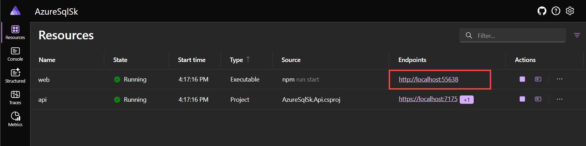

# Code walkthrough

This document highlights the key components of the codebase and provides a brief overview of how they work together to create the application.

- [Code walkthrough](#code-walkthrough)
  - [Solution](#solution)
    - [Project Structure](#project-structure)
  - [AzureSqlSk.Shared](#azuresqlskshared)
    - [SearchSessionPlugin class](#searchsessionplugin-class)
      - [Key Components](#key-components)
      - [Function Walkthroughs](#function-walkthroughs)
        - [1. AI-Generated T-SQL Queries (`QueryCustomersTable`, `QueryClaimsTable`, `QueryPoliciesTable`)](#1-ai-generated-t-sql-queries-querycustomerstable-queryclaimstable-querypoliciestable)
        - [2. Direct Stored Procedure Execution (`find_communication_history_by_subject`)](#2-direct-stored-procedure-execution-find_communication_history_by_subject)
      - [Database Interaction Libraries](#database-interaction-libraries)
      - [(Optional) Semantic Memory Functions](#optional-semantic-memory-functions)
      - [Conclusion](#conclusion)
  - [AzureSqlSk.Api](#azuresqlskapi)
    - [Configuration (`Program.cs`)](#configuration-programcs)
    - [API Controller (`ChatController.cs`)](#api-controller-chatcontrollercs)
  - [.NET Aspire Orchestration](#net-aspire-orchestration)
    - [App Host (`AzureSqlSk.AppHost`)](#app-host-azuresqlskapphost)
    - [Service Defaults (`AzureSqlSk.ServiceDefaults`)](#service-defaults-azuresqlskservicedefaults)

## Solution

The solution is composed of three main Azure components:

- [Azure SQL Database](https://learn.microsoft.com/azure/azure-sql/database/sql-database-paas-overview?view=azuresql): The database that stores the data.
- [Azure Open AI](https://learn.microsoft.com/azure/ai-services/openai/): The language model that generates the text and the embeddings.
- [Semantic Kernel](https://learn.microsoft.com/semantic-kernel/overview/): The library used to orchestrate calls to LLM to do RAG and NL2SQL and to store long-term memories in the database.

### Project Structure

- `AzureSqlSk.Api` - ASP.NET Core Web API project containing the chat and Semantic Kernel logic
- `AzureSqlSk.Web` - Vue.js frontend project with a modern chat interface
- `AzureSqlSk.Shared` - Shared library containing common models and interfaces
- `AzureSqlSk.AppHost` - .NET Aspire host project that orchestrates the API and frontend
- `AzureSqlSk.Console` - Console application for database deployment and chat interaction

## AzureSqlSk.Shared

We'll start with the `AzureSqlSk.Shared` project since it contains dependencies used by the API and Console projects.

### SearchSessionPlugin class

The `SearchSessionPlugin` class serves as a bridge between the Semantic Kernel's AI capabilities and a SQL Server database containing customer information (customers, claims, policies, communication history). It exposes several methods decorated as `[KernelFunction]` which the Semantic Kernel planner can invoke to fulfill user requests requiring database interaction.

#### Key Components

1. **Dependency Injection:** The class constructor receives necessary services via dependency injection:
    - `Kernel`: The main Semantic Kernel instance.
    - `ISemanticTextMemory`: Used for semantic memory operations (though the relevant functions are currently commented out).
    - `ILogger`: For logging purposes.
    - `string connectionString`: The connection string for the target SQL database.

    ```csharp
    public SearchSessionPlugin(Kernel kernel, ISemanticTextMemory memory, ILogger logger, string connectionString)
    {
        _logger = logger;
        _kernel = kernel;
        _memory = memory;
        _connectionString = connectionString;
    }
    ```

2. **Semantic Kernel Functions:** Methods intended for the Kernel to use are marked with `[KernelFunction("function_name")]` and include a `[Description("...")]`. The description is crucial as it helps the Kernel's planner understand what the function does and when to use it.

#### Function Walkthroughs

The plugin defines several functions to interact with different tables or stored procedures in the database.

##### 1. AI-Generated T-SQL Queries (`QueryCustomersTable`, `QueryClaimsTable`, `QueryPoliciesTable`)

These functions demonstrate a powerful pattern: using an AI model to translate a natural language request (phrased as a "logical SQL query") into an executable T-SQL query based on a provided schema.

**Pattern:**

- **Input:** A `logical_sql_query` string (e.g., "find customers in New York with an active car policy").
- **AI Interaction:**
  - An `IChatCompletionService` instance is obtained from the `Kernel`.
  - A `ChatHistory` is initialized with a system prompt instructing the AI to generate *only* T-SQL based on the user request and a detailed schema definition provided within the prompt.
  - The `logical_sql_query` is added as a user message.
  - The AI generates the T-SQL query.
- **Execution:**
  - The generated T-SQL string is cleaned up (removing markdown backticks).
  - A `SqlConnection` is opened using the provided connection string.
  - `Dapper`'s `QueryAsync` method executes the generated T-SQL.
- **Output:** The query results are returned as an `IEnumerable<dynamic>`.

**Example (`QueryCustomersTable`):**

- **Description:** The `[Description]` provides a high-level schema overview for the planner.

    ```csharp
    [KernelFunction("query_customers_table")]
    [Description("""
        Query the database to find customer's data
        The high-level schema of the database is the following:
        
        TABLE: [dbo].[customers]
        COLUMNS:
        [id]: internal customer id
        [first_name]: customer first name
        // ... other columns ...
        [active-policies]: other type of policies the customer has (life, health, car, homeowners, etc)
        """)]
    public async Task<IEnumerable<dynamic>> QueryCustomersTable(string logical_sql_query)
    // ...
    ```

- **AI Prompting:** Note how the `ChatHistory` includes detailed `CREATE TABLE` syntax and instructions on handling specific column types (like JSON).

    ```csharp
        var ai = _kernel.GetRequiredService<IChatCompletionService>();
        var chat = new ChatHistory(@"You create T-SQL queries based on the given user request and the provided schema. Just return T-SQL query to be executed. Do not return other text or explanation. Don't use markdown or any wrappers.
        The database schema is the following:

        // this table contains customer information
        CREATE TABLE [dbo].[customers]
        (
            [id] INT DEFAULT (NEXT VALUE FOR [dbo].[global_id]) NOT NULL,
            // ... columns ...
            [details] JSON NULL, -- make sure to cast to NVARCHAR(MAX) before using it in a query with OPENJSON or JSON_QUERY
            PRIMARY KEY NONCLUSTERED ([id] ASC)
        )

        the [details] column contains JSON data with the following structure:
        
        active-policies: [string...string] other type of policies the customer has (life, health, car, homeowners, etc)

        make sure to use JSON_QUERY when querying or filtering a JSON array or a JSON object.
        make sure to use double quotes when querying active-policies. For example use ""active-policies"" when trying to access that property in the json document.
        details column must be cast to NVARCHAR(MAX) before using it in a query.
        ");

        chat.AddUserMessage(logical_sql_query);
        var response = await ai.GetChatMessageContentAsync(chat);
        // ... error handling ...
        string sqlQuery = response.Content.Replace("```sql", "").Replace("```", "");
    ```

- **Database Execution:** Standard `Dapper` usage.

    ```csharp
        _logger.LogInformation($"Executing the following query: {sqlQuery}");
        await using var connection = new SqlConnection(_connectionString);
        var result = await connection.QueryAsync(sqlQuery);
        return result;
    ```

The `QueryClaimsTable` and `QueryPoliciesTable` functions follow the exact same pattern, differing only in the table schema provided in their respective descriptions and AI prompts.

##### 2. Direct Stored Procedure Execution (`find_communication_history_by_subject`)

This function shows a more direct approach where the Kernel function maps to a specific database operation – in this case, executing a stored procedure.

- **Description:** Simple description for the planner.
- **Parameters:** Takes `customerId` and `subject` as inputs.
- **Execution:**
  - Uses `Dapper`'s `QueryAsync<T>` method.
  - Specifies the stored procedure name (`dbo.find_communication_history_by_subject`).
  - Passes parameters as an anonymous object.
  - Sets `commandType: CommandType.StoredProcedure`.
  - Maps results to the `CommunicationHistory` class. `DefaultTypeMap.MatchNamesWithUnderscores = true;` helps Dapper map snake_case columns to PascalCase properties if needed.

```csharp
[KernelFunction("find_communication_history_by_subject")]
[Description("Return interactions history for a customer based on the customer id on a specified subject. If subject is not provided, return all interactions.")]
public async Task<IEnumerable<CommunicationHistory>> GetCustomerInteractions(int customerId, string subject)
{
    _logger.LogInformation($"Searching for in customers history for interactions on '{subject}' subject");

    // Optional: Helps Dapper map snake_case DB columns to PascalCase properties
    DefaultTypeMap.MatchNamesWithUnderscores = true; 

    await using var connection = new SqlConnection(_connectionString);
    var notes = await connection.QueryAsync<CommunicationHistory>("dbo.find_communication_history_by_subject",
        new
        {
            customerId,
            subject = subject ?? "" // Handle null subject
        },
        commandType: CommandType.StoredProcedure // Specify stored procedure
    );

    return notes;
}

// Supporting class for results
public class CommunicationHistory
{
    public required string Id { get; set; }
    public required string CommunicationType { get; set; }
    public required string Date { get; set; }
    public required string Details { get; set; }
}
```

#### Database Interaction Libraries

- **`Microsoft.Data.SqlClient`:** The standard ADO.NET provider for SQL Server/Azure SQL DB used for establishing the connection.
- **`Dapper`:** A popular micro-ORM used to simplify executing SQL queries and mapping results to C# objects. It's used in both the AI-generated query functions (`QueryAsync`) and the stored procedure function (`QueryAsync<CommunicationHistory>`).

#### (Optional) Semantic Memory Functions

The plugin includes commented-out functions (`store_memory_for_customer`, `retrieve_memory_for_customer`) that demonstrate potential integration with Semantic Kernel's memory capabilities, allowing the agent to store and retrieve contextual information related to specific customers using the `ISemanticTextMemory` service. When used, the chat history is persisted in the database, enabling the agent to recall past interactions and provide more personalized responses.

#### Conclusion

The `SearchSessionPlugin` effectively demonstrates two primary ways to enable a Semantic Kernel agent to interact with a SQL database:

1. **Dynamic T-SQL Generation:** Leveraging the LLM's ability to understand natural language and database schema to construct queries on the fly. This is highly flexible but relies on the AI's accuracy.
2. **Direct Operation Execution:** Mapping Kernel functions to specific, pre-defined database operations like stored procedures. This offers more control and reliability for known tasks.

By combining these techniques, you can build powerful AI agents capable of querying and manipulating relational data based on user requests and conversation context.

## AzureSqlSk.Api

This ASP.NET Core Web API project serves as the front-end for the chat application, handling user requests, orchestrating interactions with Semantic Kernel, and managing the chat conversation state.

### Configuration (`Program.cs`)

The `Program.cs` file is responsible for setting up the application's services, including Semantic Kernel, Azure OpenAI integration, and the SQL Server connection for semantic memory.

- **Configuration Loading:**
  - Configuration for Azure OpenAI (`AzureOpenAIConfig`) and SQL Server (`SqlServerConfig`) is loaded from `appsettings.json` (or other configuration sources) into strongly-typed options classes.

    ```csharp
    var azureOpenAIConfig = builder.Configuration.GetSection("AzureOpenAI").Get<AzureOpenAIConfig>();
    var sqlConfig = builder.Configuration.GetSection("SqlServer").Get<SqlServerConfig>();

    if (azureOpenAIConfig == null || sqlConfig == null)
    {
        throw new InvalidOperationException("Required configuration sections are missing");
    }
    ```

- **Azure OpenAI Services:**
  - The Azure OpenAI Chat Completion service is registered directly using the configuration values. This service will be used for generating chat responses and invoking functions.

    ```csharp
    builder.Services.AddAzureOpenAIChatCompletion(
        azureOpenAIConfig.ChatDeploymentName,
        azureOpenAIConfig.Endpoint,
        azureOpenAIConfig.ApiKey
    );
    ```

- **Semantic Memory Configuration:**
  - `ISemanticTextMemory` is registered as a singleton.
  - The `MemoryBuilder` configures the memory store:
    - `WithSqlServerMemoryStore`: Uses the SQL Server connection string to store memory vectors and metadata in the database. Requires the `Microsoft.SemanticKernel.Connectors.Memory.SqlServer` package.
    - `WithTextEmbeddingGeneration`: Configures the Azure OpenAI Embedding service to generate vector embeddings for text stored in memory.

    ```csharp
    builder.Services.AddSingleton<ISemanticTextMemory>(sp =>
    {
        var loggerFactory = sp.GetRequiredService<ILoggerFactory>();
        var httpClient = sp.GetRequiredService<HttpClient>(); // Use IHttpClientFactory in prod

        return new MemoryBuilder()
            .WithSqlServerMemoryStore(sqlConfig.ConnectionString) // SQL Server persistence
            .WithTextEmbeddingGeneration(
                (loggerFactory, httpClient) => new AzureOpenAITextEmbeddingGenerationService( // Azure OpenAI Embeddings
                    azureOpenAIConfig.EmbeddingDeploymentName,
                    azureOpenAIConfig.Endpoint,
                    azureOpenAIConfig.ApiKey,
                    // ... other parameters ...
                ))
            .Build();
    });
    ```

- **Semantic Kernel Configuration:**
  - The `Kernel` itself is registered as a singleton.
  - It's built using `Kernel.CreateBuilder()` and configured with the same Azure OpenAI Chat Completion service.
  - Crucially, an instance of the `SearchSessionPlugin` (from the `AzureSqlSk.Shared` project) is created and registered with the Kernel using `kernel.Plugins.AddFromObject()`. This makes the plugin's functions available to the Kernel's planner and chat completion service. Dependencies like `ISemanticTextMemory`, `ILogger`, and the SQL connection string are injected into the plugin's constructor.

    ```csharp
    builder.Services.AddSingleton<Kernel>(sp =>
    {
        var kernel = Kernel.CreateBuilder()
            .AddAzureOpenAIChatCompletion( // Add chat completion service to the kernel
                azureOpenAIConfig.ChatDeploymentName,
                azureOpenAIConfig.Endpoint,
                azureOpenAIConfig.ApiKey)
            .Build();

        // Resolve dependencies needed by the plugin
        var memory = sp.GetRequiredService<ISemanticTextMemory>();
        var logger = sp.GetRequiredService<ILogger<Program>>(); // Use appropriate logger category

        // Register the plugin
        kernel.Plugins.AddFromObject(new SearchSessionPlugin(kernel, memory, logger, sqlConfig.ConnectionString));

        return kernel;
    });
    ```

- **Chat History Service:**
  - A simple `ChatHistoryService` is registered as a singleton to maintain the conversation history for the current session.

    ```csharp
    builder.Services.AddSingleton<ChatHistoryService>();
    ```

- **Memory Initialization:**
  - After the application is built (`var app = builder.Build();`), the code retrieves the `ISemanticTextMemory` service and saves some initial information related to insurance policies into the configured SQL Server memory table (`sqlConfig.TableName`). This pre-seeds the memory with potentially relevant context.

    ```csharp
    using (var scope = app.Services.CreateScope())
    {
        var memory = scope.ServiceProvider.GetRequiredService<ISemanticTextMemory>();
        await memory.SaveInformationAsync(sqlConfig.TableName,
            "Premium for car insurance have been increased by 15% starting from September 2024",
            "policy-price-increase");
        // ... more SaveInformationAsync calls ...
    }
    ```

- **Other Services:** Standard ASP.NET Core services like Controllers, API Explorer, Swagger, HttpClient, and Logging are also configured.

### API Controller (`ChatController.cs`)

This controller handles the chat interactions.

- **Dependencies:** It receives the `ILogger`, `Kernel`, `ISemanticTextMemory`, `IChatCompletionService`, `IConfiguration`, and `ChatHistoryService` via dependency injection.

    ```csharp
    public ChatController(
        ILogger<ChatController> logger,
        Kernel kernel,
        ISemanticTextMemory memory,
        IChatCompletionService chatCompletion, // Note: This specific injection might be unused if kernel.GetRequiredService is used later
        IConfiguration configuration,
        ChatHistoryService chatHistory)
    {
        _logger = logger;
        _kernel = kernel;
        _memory = memory;
        _chatHistory = chatHistory;
        // Execution settings to enable automatic function calling
        _openAiPromptExecutionSettings = new AzureOpenAIPromptExecutionSettings
        {
            FunctionChoiceBehavior = FunctionChoiceBehavior.Auto()
        };
        // ... configuration reading ...
        _chatCompletion = kernel.GetRequiredService<IChatCompletionService>(); // Get service from Kernel
    }
    ```

- **Endpoints:**
  - `POST /api/chat/chat`: The main endpoint for processing user messages.
    - **Input:** Takes a `ChatRequest` object containing the user's `Message`.
    - **Memory Search:** It first searches the `ISemanticTextMemory` (SQL Server memory store) for context relevant to the user's message using `_memory.SearchAsync`.
    - **Context Injection:** If relevant memories are found, they are formatted and added to the current `ChatHistory` as a system message to provide context to the AI.

        ```csharp
            var builder = new System.Text.StringBuilder();
            await foreach (var result in _memory.SearchAsync(_sqlTableName, request.Message, limit: 3, minRelevanceScore: 0.35))
            {
                builder.AppendLine(result.Metadata.Text);
            }
            if (builder.Length > 0)
            {
                builder.Insert(0, "Here's some additional information you can use to answer the question: ");
                _chatHistory.GetHistory().AddSystemMessage(builder.ToString());
            }
        ```

    - **History Update:** The user's message is added to the `ChatHistoryService`.
    - **AI Chat Completion:** It calls `_chatCompletion.GetChatMessageContentAsync`, passing the current `ChatHistory`, the execution settings (`_openAiPromptExecutionSettings` enabling function calling), and the `Kernel` (which contains the `SearchSessionPlugin`). This allows the AI model to decide if it needs to call any functions from the plugin (like `query_customers_table`) to answer the user's query.

        ```csharp
            _chatHistory.AddUserMessage(request.Message);
            var response = await _chatCompletion.GetChatMessageContentAsync(
                _chatHistory.GetHistory(),
                _openAiPromptExecutionSettings, // Enables function calling
                _kernel                     // Provides the available functions/plugins
            );
        ```

    - **Response Handling:** The assistant's response (which could be a direct answer or the result of a function call) is added to the chat history.
    - **Output:** Returns a `ChatResponse` containing the assistant's latest message and the complete updated chat history.
  - `POST /api/chat/clear`: Clears the conversation history stored in the `ChatHistoryService`.
  - `GET /api/chat/history`: Retrieves the current conversation history.

This setup demonstrates how to build a chat API that integrates Semantic Kernel's core components (Kernel, Chat Completion, Memory, Plugins) with Azure OpenAI and uses SQL Server as a persistent semantic memory store, enabling the AI to leverage both conversational context and external data sources.

## .NET Aspire Orchestration

.NET Aspire simplifies the local development and orchestration of the multi-project `AzureSqlSk` solution.

### App Host (`AzureSqlSk.AppHost`)

- **Role:** The `AzureSqlSk.AppHost` project is the entry point for launching the application using .NET Aspire. It defines the distributed application model.
- **Functionality:**
  - It uses `DistributedApplication.CreateBuilder(args)` to initialize the Aspire application builder.
  - It adds the backend API project (`AzureSqlSk.Api`) using `builder.AddProject<Projects.AzureSqlSk_Api>("api")`.
  - It adds the Vue.js frontend project (`AzureSqlSk.Web`) as a Node.js application using `builder.AddNpmApp("web", "../AzureSqlSk.Web")`.
    - `WithHttpEndpoint(env: "PORT")` configures how Aspire assigns the frontend's port.
    - `WithReference(api)` injects the API's URL as an environment variable into the frontend container, allowing the frontend to know where to send API requests.
    - `WaitFor(api)` ensures the API starts before the frontend attempts to connect.
  - `builder.Build().Run()` starts the Aspire dashboard and launches the defined projects (API and Web).

```csharp
// In AzureSqlSk.AppHost/Program.cs
var builder = DistributedApplication.CreateBuilder(args);

// Add our API project
var api = builder.AddProject<Projects.AzureSqlSk_Api>("api");

// Add our Vue.js frontend project as a Node.js application
var web = builder.AddNpmApp("web", "../AzureSqlSk.Web")
    .WithHttpEndpoint(env: "PORT") // Configure endpoint
    .WaitFor(api)               // Ensure API is ready
    .WithReference(api);        // Inject API URL

builder.Build().Run();
```

- **Developer Experience:** When you run the `AzureSqlSk.AppHost` project, Aspire:
  - Launches the API and the web frontend.
  - Handles service discovery between the frontend and backend automatically.
  - Provides the Aspire Dashboard, a web UI showing the status, logs, traces, and endpoints for all orchestrated projects.

Aspire dashboard:



### Service Defaults (`AzureSqlSk.ServiceDefaults`)

- **Role:** This project provides common configurations applied to all service projects (like `AzureSqlSk.Api`) managed by Aspire. It ensures consistency in areas like observability and resilience.
- **Functionality:**
  - It defines an `AddServiceDefaults<TBuilder>` extension method. This method is typically called in the `Program.cs` of individual service projects (like `AzureSqlSk.Api`).
  - **Configures OpenTelemetry:** Sets up logging, metrics (ASP.NET Core, HttpClient, Runtime), and tracing (ASP.NET Core, HttpClient) instrumentation. It also configures exporters (like OTLP) based on environment variables.
  - **Adds Health Checks:** Includes default liveness health checks (`/alive`) and readiness checks (`/health`) which are exposed automatically during development.
  - **Enables Service Discovery:** Configures services to use Aspire's service discovery mechanism.
  - **Configures HttpClient Defaults:** Applies standard resilience policies (e.g., retries, timeouts via Polly) and integrates service discovery into `HttpClient` instances created by the factory.

```csharp
// In AzureSqlSk.ServiceDefaults/Extensions.cs
public static TBuilder AddServiceDefaults<TBuilder>(this TBuilder builder) where TBuilder : IHostApplicationBuilder
{
    builder.ConfigureOpenTelemetry();
    builder.AddDefaultHealthChecks();
    builder.Services.AddServiceDiscovery();
    builder.Services.ConfigureHttpClientDefaults(http =>
    {
        http.AddStandardResilienceHandler(); // Add resilience
        http.AddServiceDiscovery();         // Add service discovery
    });
    return builder;
}

// In AzureSqlSk.Api/Program.cs (example usage)
// var builder = WebApplication.CreateBuilder(args);
// builder.AddServiceDefaults(); // Apply common configurations
```

By using `AppHost` for orchestration and `ServiceDefaults` for common configuration, .NET Aspire streamlines the development workflow for building and running distributed applications like `AzureSqlSk`.
